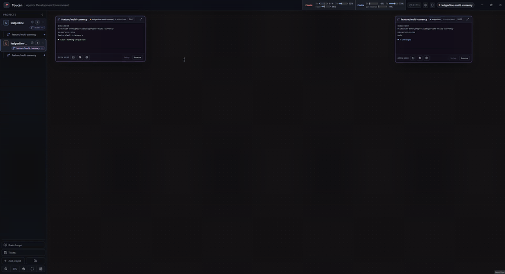

# Toucan

**A Windows desktop workspace where Claude and Codex sessions remember what earlier sessions
tried, run side by side on one canvas, and can be answered from your phone.**

*A new Claude session is asked what was already tried for quoted CSV fields and answers from
Toucan's session records. A Codex session then works in a worktree alongside it, all on one canvas.*

## Why Toucan

- **Agents remember across sessions.** After every turn Toucan records what the conversation set
  out to do, which files it touched, how it ended and what failed, without spending any model
  tokens. Later Claude and Codex sessions check those records before starting, so they build on
  earlier work instead of redoing it. Ask "what did we try for X last week?" and get an answer.
- **Many agents, one canvas.** Terminals, Claude and Codex chats, and Git worktrees are nodes on
  a zoomable canvas. Run several agents in parallel, each in its own worktree, and keep every one
  of them in view. Every node type has a keyboard shortcut, and nodes snap and tile like windows.
- **Answer your agents from your phone.** A mobile companion shows which chats are working, which
  are waiting and which need an approval. Read transcripts live, answer approvals and questions,
  and start new chats, over your own tailnet. Whichever device answers first wins; the other
  client's card resolves.

See [all features](docs/features.md) for the full tour.

## Install

Download `Toucan-Setup-<version>-x64.exe` from the
[latest release](https://github.com/Tucaen/toucan/releases/latest) and run it. It installs per
user without admin rights and updates itself in the background; nothing is applied until you
click **Restart to update**.

The builds are not yet code-signed, so Windows SmartScreen shows "Windows protected your PC" on
first run: click **More info**, then **Run anyway**.

Claude and Codex use their existing subscription sign-in; Toucan bundles both agent adapters, so
you do not need Node or npm.

## Quick start

1. **Add project** in the sidebar and pick a folder.
2. Right-click the canvas, or use the keyboard: `Ctrl+N` Claude, `Ctrl+Shift+N` Codex, `Ctrl+T`
   terminal, `Ctrl+Shift+G` worktree, `Ctrl+H` conversation history, `Ctrl+P` file.
3. Arrange nodes with `Alt+Arrow` (snap to halves and quarters) and `Ctrl+Shift+A` (tile).
4. For the phone companion, follow the [mobile companion setup](docs/mobile-companion-setup.md).

## How it's built

Toucan is an Electron app with a privileged main process, a narrow context-isolated preload seam
and a React renderer; the [architecture map](docs/architecture.md) covers the details. A few
decisions worth calling out:

- **Session memory is plain Markdown, not a database.** Each conversation gets one small record,
  written atomically at every turn boundary from the transcript alone. Agents read the records
  with `grep` over a sandboxed folder, so recalling past work costs a few hundred bytes of context
  and no extra model call. See [the design notes](docs/plans/session-outcome-index.md).
- **Phone and desktop can never both answer.** A pending approval is resolved in one place on the
  host, keyed on the request the agent is waiting on, so the race between two clients is decided
  in the host rather than in either UI.
- **Provider-neutral agents.** Claude and Codex both run through Agent Client Protocol adapters
  behind one session manager, and each adapter version can be updated or pinned independently of
  the app. See [adapter management](docs/adapter-management.md).
- **Architecture rules are enforced, not just written down.** `npm run check` runs Prettier, typed
  ESLint with zero warnings allowed, dependency-cruiser boundary rules, strict TypeScript and
  about 290 test files. CI runs the same gate on every push to `main` and every pull request,
  and a release is only published if it passes.

## How this was built

Toucan is built with AI coding agents, mostly Claude Code and Codex, and increasingly from inside
Toucan itself. I decide what gets built and how it fits together, review what the agents produce,
and maintain the guardrails that keep the quality up: the verification gate above, an
[architecture map](docs/architecture.md), and an [AGENTS.md](AGENTS.md) that records the
project's non-obvious invariants so every new session starts from them. Directing agents well
turned out to be the most interesting engineering problem here, which is why so much of Toucan is
about giving them memory and oversight.

## Status

Toucan is under active development and targets Windows x64 only. Workspace state stays on your
machine. Live shell processes end when Toucan exits; restoring running terminals is not
implemented.

## Documentation

- [Features](docs/features.md): everything Toucan does today.
- [Developing Toucan](docs/development.md): setting up a checkout, the verification gate,
  packaging and releases.
- [Architecture map](docs/architecture.md): process topology, module ownership and dependency
  boundaries.
- [AGENTS.md](AGENTS.md): operational invariants and sharp edges for agents working in the
  repository.
- `docs/research` preserves ideas and investigations; they are not claims about current behavior
  unless promoted into the features page or the architecture map.

## License and security

Toucan is licensed under the [Apache License 2.0](LICENSE). Report vulnerabilities privately as
described in [SECURITY.md](SECURITY.md).
