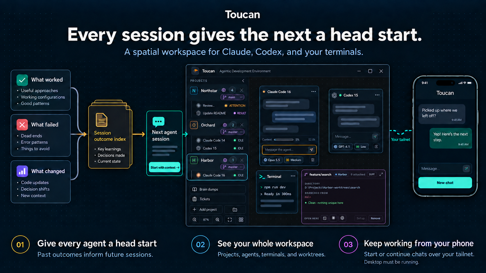

# Toucan features

The full tour of what Toucan does today. The [README](../README.md) has the short version.

## What Toucan does

- Gives agents memory across sessions. After every turn Toucan records what the conversation set out to do, which files it touched, how it ended and what failed, without spending any model tokens. Later Claude and Codex sessions check those records before starting, so they build on earlier work instead of redoing it. Ask an agent "what did we try for X last week?" to look something up.
- Keeps multiple projects, terminals, and coding-agent conversations visible on one
  zoomable canvas. Every node can temporarily fit the visible canvas and then restore its
  exact previous position and size from the header.
- Creates every canvas node type from the context menu or from the keyboard: `Ctrl+T` terminal,
  `Ctrl+N` Claude, `Ctrl+Shift+N` Codex, `Ctrl+Shift+G` worktree, `Ctrl+H` history browser and
  `Ctrl+P` file. A shortcut drops its node at the viewport centre and yields inside a terminal.
- Runs Claude and Codex through provider-neutral ACP chat nodes with sign-in, approvals,
  model and effort controls, slash commands, Markdown, file attachments, and local voice
  dictation.
- Interleaves plans, reasoning, commands, edits, delegation, and other tool activity with
  the conversation transcript. **Focus** mode hides that detail without discarding it.
- Queues prompts submitted while an agent is busy, with controls to edit, withdraw, or
  explicitly send a queued prompt into the running turn.
- Creates and discovers Git worktrees as persistent canvas nodes. Sessions opened from a
  worktree share its working directory, and removal is blocked or confirmed according to
  the work that would be lost.
- Browses locally recorded Claude and Codex conversation history across a project checkout
  and its worktrees, then resumes a selected conversation as a new canvas node.
- Restores saved canvas state, conversation nodes, drafts, attention, and recently closed
  sessions. `Ctrl+Shift+T` reopens the most recently closed session node.
- Shows retained display-only output for dormant plain terminals and provider account or
  session usage when the provider exposes it.
- Browses the personal brain-dump library in a resizable panel docked beside the canvas:
  search active or archived topics, follow `[[slug]]` links, and archive completed topics.
  Archived topics remain immutable snapshots; later work is captured as a linked active
  follow-up. Capture a new dump by typing or dictating it for the brain-dump skill to organize
  in the background. `Ctrl+Shift+B` toggles the panel; `Ctrl+K` focuses its search while it is open.

- Serves a mobile companion to your phone over your own tailnet. The remote server is off
  until you turn it on, pairing is one long token, and the phone shows the workspace's active
  agent chats with status, unread badges and a distinct "needs approval" state. Open one to
  read its transcript live, send a message, and answer what the agent is waiting on - tool
  permissions and structured questions alike. Answering is race-safe: whether you answer on
  the phone or on the desktop, exactly one answer reaches the agent and the other client's
  card resolves. Start a new chat for a project from the phone, and keep several PCs in one
  installed app, switching between them. The chat list also shows how much of each provider's
  plan is left and when each window resets - waiting out a limit is something you do away from
  the desk - and a conversation shows its own context fill, cost and nearest limit. Put
  `tailscale serve` in front of a host and the client installs to the Android home screen as a
  standalone app.

Live shell processes still end when Toucan exits, and live PTY process restoration is not
implemented.

## Agent adapter versions

Open **Agent adapters** using the gear button in the top bar to update Claude or Codex
without updating Toucan. **Bundled with Toucan** is the factory choice and follows the
version shipped with each application release. **Check for updates** lists published
versions, including labelled prereleases; choose one and click **Install and use**.
Downloaded versions remain pinned across Toucan updates. **Use bundled** restores the
factory choice without a download, and previously installed versions can be selected offline.

Running conversations keep their existing adapter process. Start a new session or restart
a session to use the selected version. Installation and an initial ACP compatibility check
must succeed before the selection changes; a failed update leaves the previous selection
in place. A successful check does not guarantee every model or history-resume feature works
with every version. The bundled version remains available if an update causes problems.

Toucan stores downloaded adapters and their dependency lockfiles in its application-data
directory, separately from the app and your projects. It includes its own npm installer;
installed users do not need to install Node or npm. Updates are manual and require access
to the public npm registry. See [adapter management](adapter-management.md) for the
implementation and compatibility limits.

## Use Toucan from your phone

Remote access is off in a fresh install. Open it from the phone icon in the header, enable it,
and note the port and pairing token.

Reachability is deliberately not Toucan's problem: install [Tailscale](https://tailscale.com)
on the PC and the phone, join both to the same tailnet, then open `http://<tailnet-address>:<port>`
in the phone's browser and paste the pairing token once. The dialog lists the addresses to try
and labels the tailnet one. A device on your tailnet is _reachable_, not _trusted_ - the token is
what authorizes it, so **Regenerate** locks out every phone holding the old one.

To install the client to the home screen, put HTTPS in front of that port with
`tailscale serve` - a browser will not register a service worker over plain HTTP, so installing
needs a secure origin, and Toucan deliberately owns no certificates. Over plain HTTP the app
still works as an ordinary web page; it just never offers to install.

**[Mobile companion setup](mobile-companion-setup.md)** walks the whole path
end to end, including adding a second PC and what the tailnet and the token each protect.

The desktop has to be running: the server lives in Toucan's main process, and the phone shows the
canvas that desktop has open. Plain terminals are never listed.
